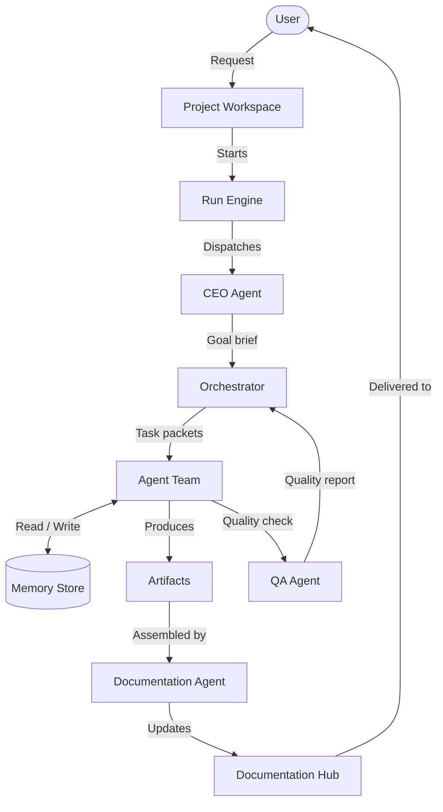
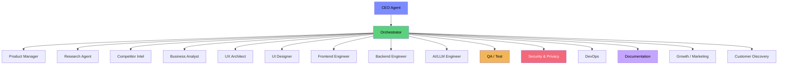
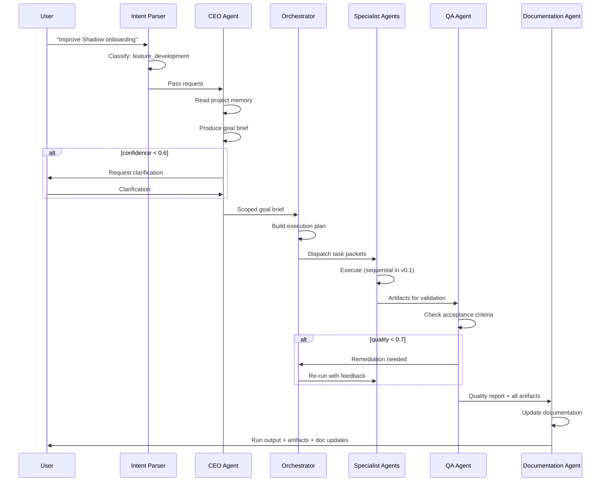
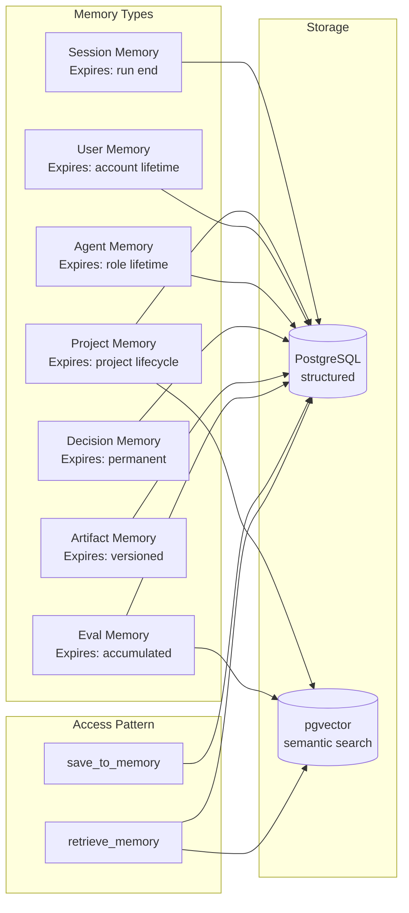
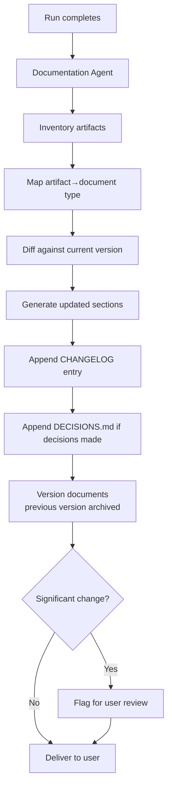
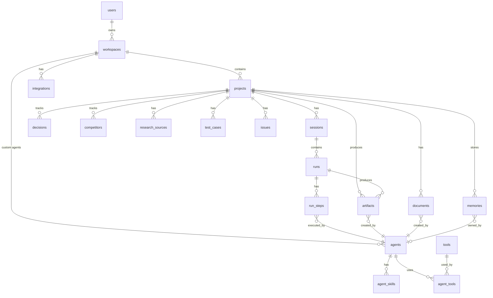
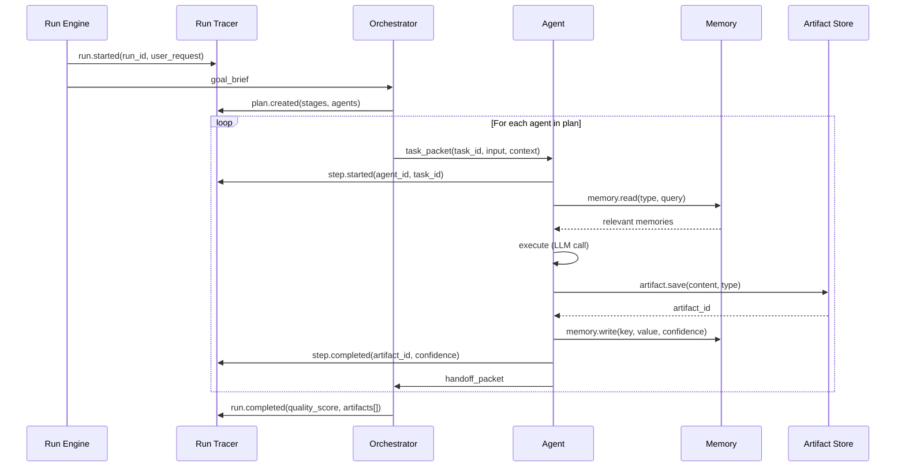
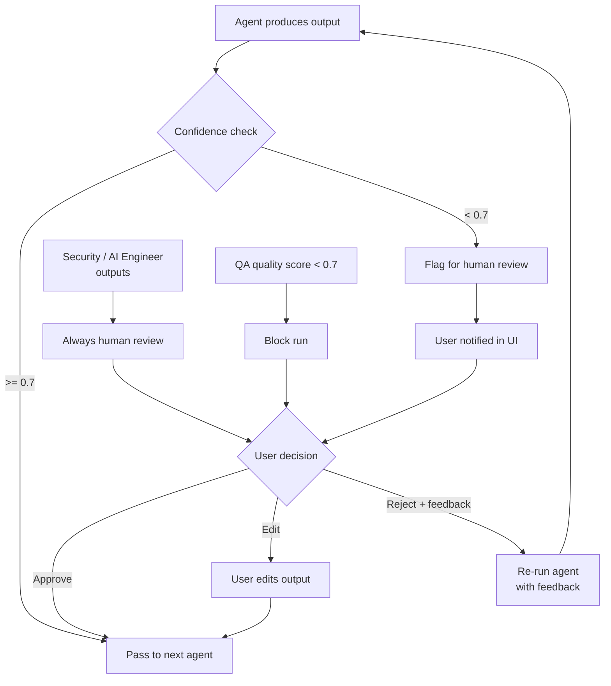
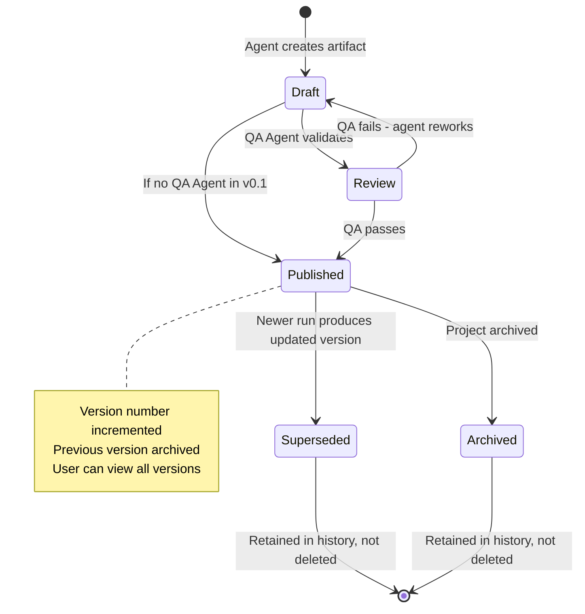

# System Diagrams

---

## A. System Overview

---

## B. Agent Hierarchy

---

## C. User Request Lifecycle

---

## D. Memory Architecture

---

## E. Documentation Generation Pipeline

---

## F. Database Entity Relationship

---

## G. MVP Workflow (v0.1)

```mermaid
graph TD
    U([User]) -->|Text request| IP[Intent Parser]
    IP --> Orch[Orchestrator\nacts as CEO in v0.1]
    Orch --> PM[PM Agent\nrequirements + user stories]
    PM --> Res[Research Agent\nresearch notes + sources]
    Res --> UX[UX Agent\nuser flow + edge states]
    UX --> DOC[Documentation Agent\nPRD.md + CHANGELOG]
    DOC --> OUT[Run Output]
    OUT --> U

    PM -.->|reads| MEM[(Project Memory)]
    DOC -.->|writes| MEM
    MEM -.->|context for| Orch

    style MEM fill:#161922,stroke:#7C8CFF
```

---

## H. Run Tracing Flow

---

## I. Human Review Flow

---

## J. Artifact Lifecycle

---

*All diagrams use valid Mermaid syntax. Render at mermaid.live or in any Markdown renderer that supports Mermaid.*
